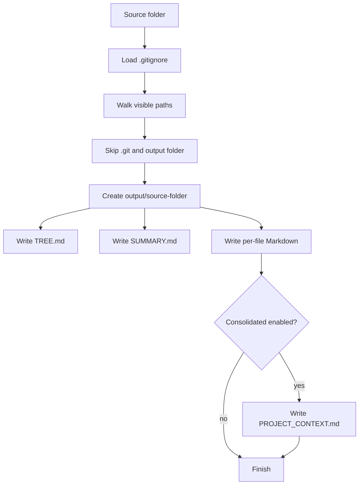

# Export to Markdown


Export a source directory into Markdown files that are easier to inspect,
archive, or paste into LLM workflows.

The script walks a folder, respects `.gitignore`, skips `.git`, preserves the
original tree, and writes each export under `markdown_export/<folder-name>/`.

## Features

- Respects `.gitignore` using `pathspec`
- Excludes `.git` and the configured output directory
- Writes output to `<output>/<source-folder-name>/`
- Preserves the source directory structure inside the export folder
- Creates one Markdown file per source file
- Adds file metadata: relative path, size, estimated MIME type, and SHA-256
- Detects likely binary files and omits raw binary content
- Omits raw content for files above the configured size limit
- Generates `TREE.md`, `SUMMARY.md`, and optionally `PROJECT_CONTEXT.md`

## Output Files

| File | Purpose |
|---|---|
| `TREE.md` | Directory tree for the exported project |
| `SUMMARY.md` | File counts, directory counts, total bytes, and extension stats |
| `PROJECT_CONTEXT.md` | Consolidated text context for LLM review |
| `<source-file>.md` | Metadata and content for each exported source file |

## How It Works



## Installation

Create a virtual environment and install the only runtime dependency:

```bash
python3 -m venv .venv
source .venv/bin/activate
python -m pip install -r requirements.txt
```

## Usage

Export a folder into `markdown_export/<folder-name>/`:

```bash
python export_to_md_v3.py /path/to/folder
```

Choose a different base output folder:

```bash
python export_to_md_v3.py /path/to/folder -o markdown_export
```

Increase the per-file raw content limit:

```bash
python export_to_md_v3.py /path/to/folder --max-file-size-mb 5
```

Increase the consolidated context limit:

```bash
python export_to_md_v3.py /path/to/folder --max-combined-size-mb 20
```

Skip `PROJECT_CONTEXT.md`:

```bash
python export_to_md_v3.py /path/to/folder --no-consolidated
```

## CLI Reference

```text
usage: export_to_md_v3.py [-h] [-o OUTPUT]
                          [--max-file-size-mb MAX_FILE_SIZE_MB]
                          [--max-combined-size-mb MAX_COMBINED_SIZE_MB]
                          [--no-consolidated]
                          folder
```

| Argument | Default | Description |
|---|---:|---|
| `folder` | required | Source folder to analyze |
| `-o, --output` | `markdown_export` | Base folder where `<source-folder-name>/` is created |
| `--max-file-size-mb` | `2` | Maximum individual file size for raw content |
| `--max-combined-size-mb` | `10` | Maximum size for `PROJECT_CONTEXT.md` content |
| `--no-consolidated` | `false` | Do not generate `PROJECT_CONTEXT.md` |

## Example Output

```text
markdown_export/
└── my-project/
    ├── TREE.md
    ├── SUMMARY.md
    ├── PROJECT_CONTEXT.md
    ├── README.md.md
    └── src/
        ├── main.py.md
        └── services/
            └── user.py.md
```

## Validation

Run a syntax check and a small export:

```bash
python -m py_compile export_to_md_v3.py
python export_to_md_v3.py . -o /tmp/md-extractor-output --max-combined-size-mb 1
```

## Contributing

See [CONTRIBUTING.md](CONTRIBUTING.md). Commits must use Conventional Commits.
